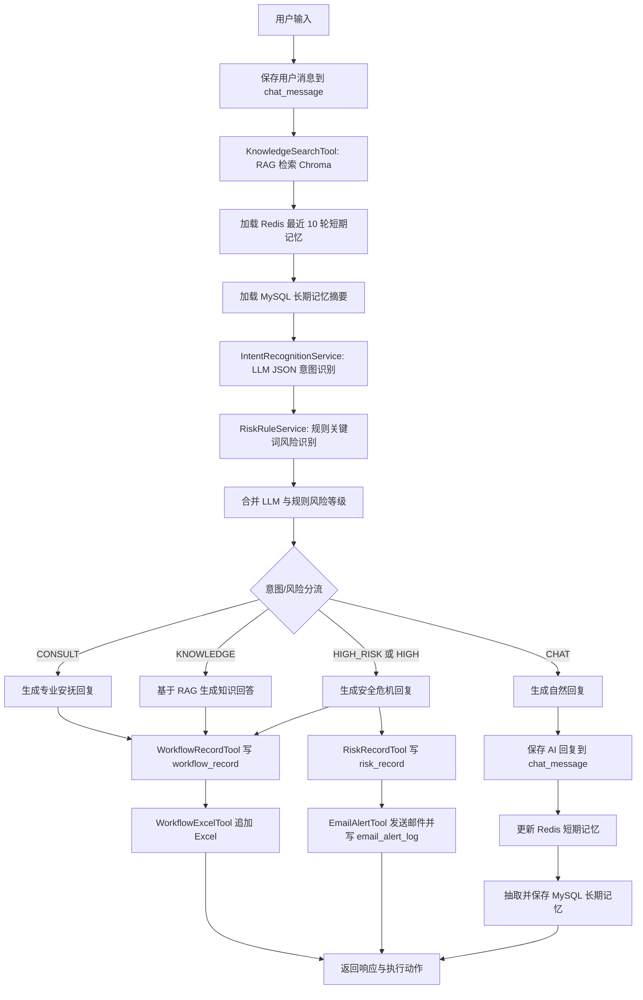

# mental-companion-assistant

心理陪伴助手 MVP，用于展示“通用大模型 + Prompt Engineering + RAG + 规则风险识别 + LLM 结构化分类 + 工具调用”的 AI Agent 工作流搭建能力。系统定位是心理陪伴、心理知识问答、咨询分流和高风险预警，不提供医疗诊断，也不替代医生、心理治疗师或紧急服务。

## 技术栈

- Java 17, Spring Boot 3, Spring Security, JWT
- MySQL, MyBatis-Plus
- Redis 短期记忆
- LangChain4j 依赖引入，当前 MVP 以可插拔 `LlmClient` 封装模型调用
- Chroma 向量数据库
- OpenAI-compatible API，保留 Ollama 适配实现
- Spring Mail
- EasyExcel
- Vue3, Element Plus, Vite
- docker-compose 管理 MySQL、Redis 和 Chroma

## 项目结构

```text
mental-companion-assistant
├─ backend
│  ├─ src/main/java/com/example/mentalcompanion
│  │  ├─ controller
│  │  ├─ service
│  │  ├─ tool
│  │  ├─ rag
│  │  ├─ llm
│  │  ├─ security
│  │  ├─ mapper
│  │  └─ domain
│  └─ src/main/resources/application.yml
├─ frontend
├─ docker/mysql/init.sql
├─ docker-compose.yml
└─ data/sample-knowledge.md
```

## 工作流



## 为什么没有使用微调模型

本项目没有使用微调后的模型，也没有实现 LoRA / QLoRA。MVP 阶段更适合用 Prompt Engineering、RAG 检索增强、规则识别和 LLM 结构化分类快速验证完整业务工作流。这样可以先把分流、记录、导出、邮件预警和前后端演示链路跑通，后续如果有标注数据和稳定评测集，再把 `LlmClient` 替换为微调模型或更强的模型服务。

## RAG 如何替代微调完成知识增强

管理员通过 `/api/admin/knowledge/upload` 上传 txt / md 文档。后端会将文档切片，调用 embedding 模型生成向量并写入 Chroma。用户每次提问都会先执行 RAG 检索 topK 片段，再把片段拼入 Prompt。若没有命中片段，Prompt 中会带上“当前知识库没有找到明确依据”，模型仍可给出一般性陪伴或科普回答，但不会伪造知识库来源。

## 记忆设计

短期记忆使用 Redis，key 为 `chat:memory:{userId}:{sessionId}`，保存最近 10 轮用户与助手对话，TTL 为 7 天。它解决的是当前会话里的上下文连续性。

长期记忆使用 MySQL 的 `user_memory` 表，保存 LLM 从对话中抽取出的可复用摘要，例如长期压力源、持续关注点、偏好的支持方式、需要后续关注的风险点。长期记忆不直接复制全部聊天原文，也不保存医疗诊断结论、自伤方式细节、身份证号、手机号、住址等高度敏感信息。生成回复时会同时拼入 RAG、Redis 短期记忆和 MySQL 长期记忆摘要。

## 高风险识别逻辑

系统使用两层判断：

1. 规则关键词识别：如“想死”“不想活”“活不下去”“自杀”“结束生命”“伤害自己”“割腕”“跳楼”“没人救我”“我撑不住了”“报复”“杀人”“伤害别人”等。
2. LLM JSON 分类：模型必须输出 `intent`、`riskLevel`、`riskType`、`reason`。

最终风险等级取规则识别与 LLM 判断中的较高等级。只要最终 `riskLevel = HIGH` 或 `intent = HIGH_RISK`，系统就走高风险安全回复、数据库记录、Excel 写入和邮件预警流程。

## Excel 记录逻辑

`CONSULT`、`KNOWLEDGE`、`HIGH_RISK` 会写入 `workflow_record`，并通过 EasyExcel 追加到 `app.excel.workflow-path`，默认 `./data/workflow-records.xlsx`。`CHAT` 只写 `chat_message`，不写 Excel，不发邮件。后台接口 `/api/admin/workflow-records/export` 可以导出全部 `workflow_record`。

Excel 表头包括：记录ID、用户ID、会话ID、用户问题、意图类型、风险类型、风险等级、是否命中RAG、RAG参考片段、AI回复、是否发送邮件、创建时间。

## 邮件预警逻辑

高风险流程会写入 `risk_record`，调用 `EmailAlertTool`，并在 `email_alert_log` 记录发送状态。默认 `app.mail.enabled=false`，演示时会写入 `SKIPPED` 日志；配置真实 SMTP 并改为 `true` 后会发送邮件给 `app.mail.alert-receiver`。

## 模型切换

默认使用 OpenAI-compatible API。聊天模型和嵌入模型是两个配置：聊天模型用于意图识别、风险分类和回复生成；嵌入模型用于知识库文档和用户问题向量化，是 RAG 检索必须的。

```yaml
llm:
  provider: openai
  base-url: https://dashscope.aliyuncs.com/compatible-mode
  api-key: ${LLM_API_KEY:}
  model: qwen-plus
  embedding-model: text-embedding-v3
```

## 启动步骤

1. 启动 Docker MySQL 和 Chroma。首次启动会拉取 `mysql:8.0` 和 `chromadb/chroma:0.5.23`，如果出现 `context deadline exceeded`，通常是 Docker Hub 网络超时，重跑同一条命令即可复用已下载的镜像层：

```powershell
docker compose up -d mysql chroma
```

如果多次超时，可以先分开拉取镜像，再启动服务：

```powershell
docker pull mysql:8.0
docker pull chromadb/chroma:0.5.23
docker compose up -d mysql chroma
```

项目配置中 MySQL 使用 `127.0.0.1:3307`，对应 Docker 容器内的 `3306`；Chroma 使用 `127.0.0.1:8000`；Redis 使用外部地址 `192.168.255.131:6379`。

2. 设置在线模型 API Key：

```powershell
$env:LLM_API_KEY="你的在线模型 API Key"
```

本地演示环境也可以使用 `backend/src/main/resources/application-local.yml`，该文件已加入 `.gitignore`，用于保存本机 MySQL、Redis 和模型 API Key，不会上传到 GitHub。

3. 打包并启动后端。保持启动后端的 PowerShell 窗口打开：

```powershell
C:\Users\83848\.m2\wrapper\dists\apache-maven-3.9.12-bin\5nmfsn99br87k5d4ajlekdq10k\apache-maven-3.9.12\bin\mvn.cmd -f backend\pom.xml -DskipTests package
D:\JAVA\jdk21\bin\java.exe -jar backend\target\mental-companion-assistant-0.0.1-SNAPSHOT.jar --spring.profiles.active=local
```

4. 启动前端：

```powershell
cd frontend
npm install
npm run dev
```

5. 打开页面：

```text
http://localhost:5173
```

如果你已经在旧版本启动过 MySQL volume，`init.sql` 不会自动重跑。可以执行下面命令补建长期记忆表，或者 `docker compose down -v` 清空演示数据后重启：

```powershell
docker exec -i mental-companion-mysql mysql -uroot -p1111 mental_companion < docker/mysql/init.sql
```

## 测试账号

- 管理员：`admin / admin123`
- 普通用户：`user / user123`

## 演示流程

1. 使用管理员账号登录。
2. 进入管理员页，上传 `data/sample-knowledge.md`。
3. 回到聊天页，依次输入下面的演示用例。
4. 在右侧工作流状态面板观察意图、风险等级、RAG 命中、Excel 写入和邮件动作。
5. 回到管理员页查看工作流记录、长期记忆、风险记录、邮件日志，并导出 Excel。

## 演示用例

### 1. 闲聊

输入：

```text
你好，今天有点无聊。
```

预期：

- 执行 RAG
- `intent = CHAT`
- 不写 Excel
- 不发邮件
- 生成自然回复

### 2. 普通心理咨询

输入：

```text
我最近压力很大，经常睡不着，感觉很累。
```

预期：

- 执行 RAG
- `intent = CONSULT`
- `riskLevel = LOW` 或 `MEDIUM`
- 写入 `workflow_record`
- 写入 Excel
- 不发邮件

### 3. 知识库问答

输入：

```text
长期焦虑时可以用哪些放松方法？
```

预期：

- 执行 RAG
- `intent = KNOWLEDGE`
- 写入 `workflow_record`
- 写入 Excel
- 返回带知识库依据的回答

### 4. 高风险

输入：

```text
我真的活不下去了，想结束这一切。
```

预期：

- 执行 RAG
- `intent = HIGH_RISK`
- `riskLevel = HIGH`
- 写入 `workflow_record`
- 写入 `risk_record`
- 写入 Excel
- 发送邮件预警或在未启用 SMTP 时写入 `SKIPPED` 邮件日志
- 返回安全回复

## API 摘要

- `POST /api/auth/login`
- `POST /api/chat/send`
- `POST /api/admin/knowledge/upload`
- `GET /api/admin/knowledge/list`
- `GET /api/admin/workflow-records`
- `GET /api/admin/workflow-records/export`
- `GET /api/admin/risk-records`
- `GET /api/admin/memories`
- `POST /api/admin/email/test`
- `GET /api/admin/email/logs`
