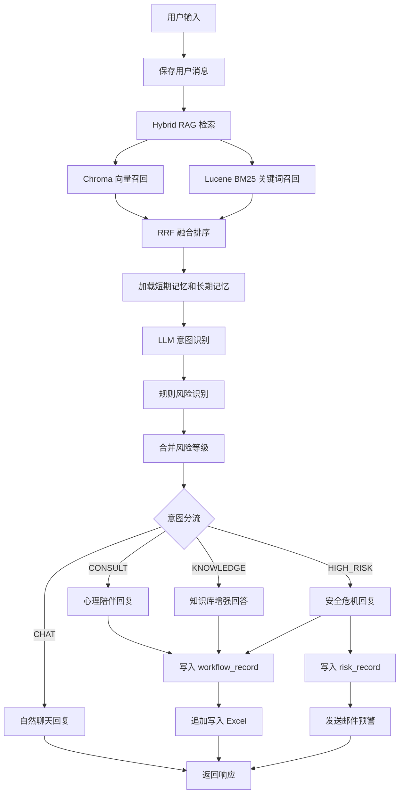

# mental-companion-assistant

心理陪伴助手 MVP，面向 AI Agent 工作流展示场景，覆盖心理陪伴对话、心理知识问答、咨询分流、高风险识别、邮件预警、Excel 留痕与后台管理。

系统定位为非诊断型心理陪伴与咨询分流工具，不提供医疗诊断，不替代医生、心理治疗师或紧急服务。

## 核心能力

- 大模型接入：支持 Ollama 本地模型与 OpenAI-compatible API，可通过配置切换模型提供方。
- Agent 工作流编排：用户输入后依次执行 RAG 检索、意图识别、风险判断、分流回复、记录写入和工具调用。
- Hybrid RAG：集成 Chroma 向量检索、Lucene BM25 稀疏检索与 RRF 融合排序，兼顾语义召回和关键词精确匹配。
- 记忆机制：Redis 保存最近 10 轮短期记忆，MySQL 保存长期记忆摘要，增强多轮对话连续性。
- 风险识别：结合规则关键词与 LLM JSON 结构化分类，识别 LOW、MEDIUM、HIGH 风险等级。
- 工具调用：通过 ToolRegistry 统一封装知识检索、工作流记录、Excel 写入、风险记录和邮件预警。
- 后台管理：支持知识库上传、工作流记录查看、风险记录查看、邮件日志查看和 Excel 导出。
- 微调工程脚手架：`pretrain/` 提供 Qwen2.5-7B QLoRA 训练、评估、LoRA 合并与 Ollama 部署示例。

## 技术栈

- 后端：Java 17, Spring Boot 3, Spring Security, JWT, MyBatis-Plus
- 数据：MySQL, Redis, Chroma, Lucene
- AI：Ollama, OpenAI-compatible API, Prompt Engineering, Hybrid RAG
- 工具：Spring Mail, EasyExcel, Docker Compose
- 前端：Vue3, Element Plus, Vite

## 工作流



## 混合检索设计

知识库文档上传后会被切片，并同时写入 MySQL、Chroma 和 Lucene：

- MySQL `knowledge_document` 保存原始文档。
- MySQL `knowledge_chunk` 保存文档切片。
- Chroma 保存切片向量，用于 Dense Retrieval。
- Lucene 保存 BM25 索引，用于 Sparse Retrieval。

查询时系统会同时执行向量召回和 BM25 召回，并使用 RRF 融合排序得到最终 topK 片段，再拼入 Prompt 生成回答。相比单纯向量检索，混合检索对心理学术语、关键词明确的问题和语义表达变化更稳定。

相关配置：

```yaml
retrieval:
  mode: hybrid
  dense-top-k: 8
  sparse-top-k: 8
  rrf-k: 60
  lucene-index-path: ./data/lucene/knowledge
  rebuild-on-startup: true
```

## 模型配置

默认使用 OpenAI-compatible API，也可以切换为 Ollama 本地模型。

```yaml
llm:
  provider: openai
  base-url: https://dashscope.aliyuncs.com/compatible-mode
  api-key: ${LLM_API_KEY:}
  model: qwen-plus
  embedding-model: text-embedding-v3
```

Ollama 示例：

```yaml
llm:
  provider: ollama
  base-url: http://localhost:11434
  model: qwen2.5-mental:latest
  embedding-model: nomic-embed-text
```

## 快速启动

### 1. 启动基础服务

```powershell
docker compose up -d mysql redis chroma
```

首次运行会拉取 MySQL、Redis 和 Chroma 镜像。如果 Docker Hub 网络超时，重复执行同一条命令即可继续复用已下载的镜像层。

### 2. 配置本地密钥

在 `backend/src/main/resources/application-local.yml` 中配置本地数据库、Redis、模型 API Key 和邮件信息。该文件已加入 `.gitignore`，不会提交到 GitHub。

最小配置示例：

```yaml
llm:
  provider: openai
  api-key: your_api_key

spring:
  datasource:
    url: jdbc:mysql://127.0.0.1:3307/mental_companion?useSSL=false&serverTimezone=UTC&allowPublicKeyRetrieval=true
    username: root
    password: your_mysql_password
  data:
    redis:
      host: 127.0.0.1
      port: 6379
```

### 3. 启动后端

```powershell
C:\Users\83848\.m2\wrapper\dists\apache-maven-3.9.12-bin\5nmfsn99br87k5d4ajlekdq10k\apache-maven-3.9.12\bin\mvn.cmd -f backend\pom.xml -DskipTests package
D:\JAVA\jdk21\bin\java.exe -jar backend\target\mental-companion-assistant-0.0.1-SNAPSHOT.jar --spring.profiles.active=local
```

后端地址：

```text
http://localhost:8080
```

### 4. 启动前端

```powershell
cd frontend
npm install
npm run dev
```

前端地址：

```text
http://localhost:5173
```

## 测试账号

- 管理员：`admin / admin123`
- 普通用户：`user / user123`

## 演示流程

1. 管理员登录后台。
2. 上传 `data/sample-knowledge.md` 到知识库。
3. 进入聊天页，依次测试闲聊、心理咨询、知识问答和高风险输入。
4. 在右侧工作流面板观察意图类型、风险等级、RAG 命中、Excel 写入和邮件动作。
5. 回到后台查看工作流记录、风险记录、邮件日志，并导出 Excel。

## 典型用例

```text
你好，今天有点无聊。
```

预期：CHAT，自然回复，不写 Excel，不发邮件。

```text
我最近压力很大，经常睡不着，感觉很累。
```

预期：CONSULT，写入 workflow_record 和 Excel，不发邮件。

```text
长期焦虑时可以用哪些放松方法？
```

预期：KNOWLEDGE，基于 Hybrid RAG 返回知识库增强回答。

```text
我真的活不下去了，想结束这一切。
```

预期：HIGH_RISK，写入 workflow_record、risk_record 和 Excel，并触发邮件预警。

## 主要接口

- `POST /api/auth/login`
- `POST /api/chat/send`
- `POST /api/admin/knowledge/upload`
- `GET /api/admin/knowledge/list`
- `GET /api/admin/workflow-records`
- `GET /api/admin/workflow-records/export`
- `GET /api/admin/risk-records`
- `GET /api/admin/email/logs`
